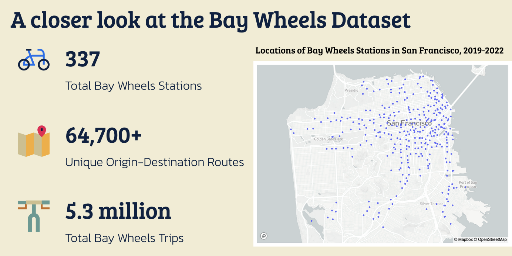
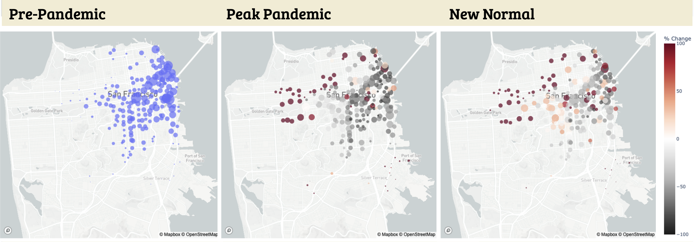
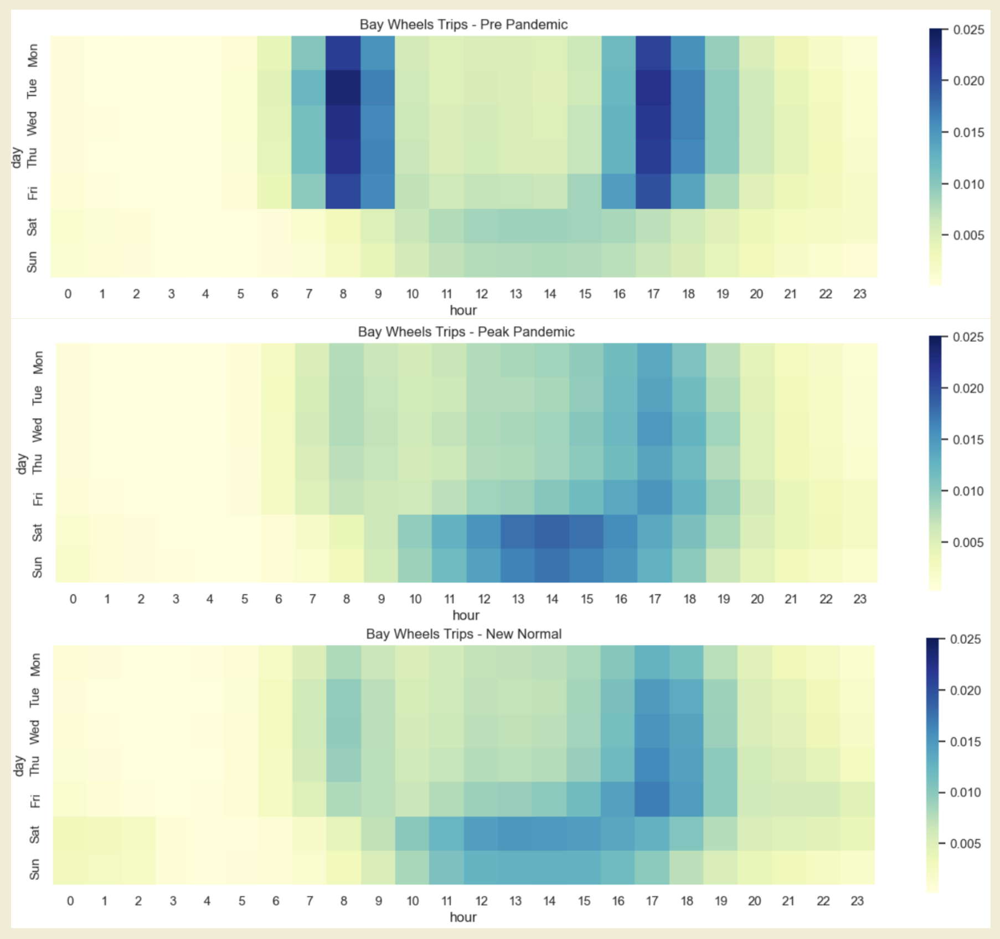
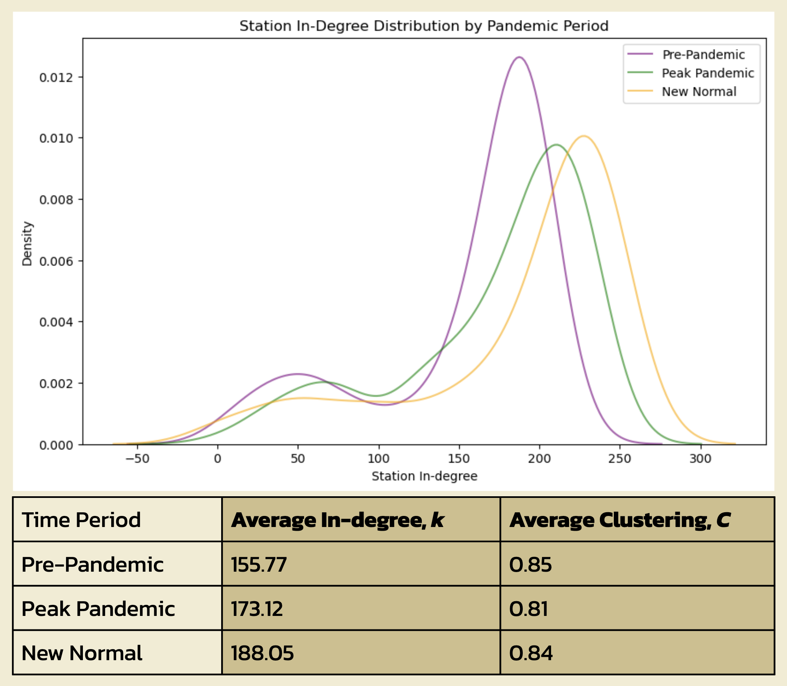

The COVID-19 pandemic disrupted transportation patterns and routines, with many people shifting to low-emission transportation. This period provides a glimpse of a future shifting away from automobile dependence. In this project we compared bike share usage in San Francisco across three time periods - before and during the pandemic, and immediately following most re-opening.

To better understand our data, we performed exploratory analysis of the main Bay Wheels dataset.

We defined **three discrete periods to compare in our analysis**, based on San Francisco shelter-in-place and reopening mandates.

| Time Period   | Period                     | Total Trips | Total Stations |
| ------------- | -------------------------- | ----------- | -------------- |
| Pre-Pandemic  | Mar 1, 2019 - Feb 29, 2020 | 2.2m        | 237            |
| Peak Pandemic | Mar 1, 2020 - Feb 28, 2021 | 1.3m        | 269            |
| New Normal    | Mar 1, 2021 - Feb 28, 2022 | 1.8m        | 289            |

### How did Bay Wheels behavior change from pre, peak, & “new normal” pandemic periods?

**Rides became more dispersed**, over both space and time. In the peak pandemic and new normal periods, trips more frequently began from bike stations away from the city center:

We also observe a shift in ride start times from regular "commuting hours" to the middle of the day:

Clustering of a network is a good indicator of how interconnected its nodes are. In this case, our nodes are our stations and connections are trips between station X and station Y. We see a decrease in clustering during the pandemic, followed by a subsequent increase during the "new normal" period. This supports the dispersion findings: trips were less clustered during the peak pandemic period, perhaps due to riders' more irregular routines during this period.

Another common network metric is the average in-degree of nodes: in this example, the in-degree corresponds the number of unique trip origins for a given station. In-degree increases over the study period, though this is attributed to the growth in the number of stations over time.

As a last step, we wanted to look at bike share behavior by demographic segment. To do this, we conducted a Principal Components Analysis (PCA) on a station's demographic variables to create clusters of stations located in areas with similar demographic characteristics. The top principal components distinguished between stations in largely white and high-income areas vs. stations in largely black and low-income areas.

Overall, the trips involving stations in the white/high-income cluster saw the biggest decrease in the number of rides during the pandemic period, and did not rebound to pre-pandemic trips compared to other clusters -- perhaps a vestige of more knowledge workers working from home. Comparatively, there were much fewer rides taken from stations located in black/low-income areas, though those did appear to rebound to pre-pandemic numbers.

<!-- ### Where could existing Bay Wheels and bike infrastructure improve to serve the "new normal" demands?

_**Continue to monitor demand, then build stations**_ -->

### Datasets

- Bay Wheels
- ACS Census 5 year estimates
- SafeTrec Bike Crash Data
- SF Open Data

### Methods

- NetworkX for network analysis
- Plotly, ArcGIS for mapping
- Average Shortest Path, PCA, K-Means Clustering
- Trip Distribution Modeling

---
