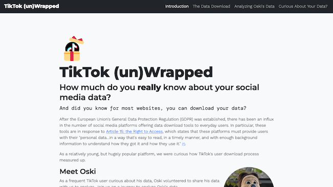

[TikTok Unwrapped](https://ochan1.github.io/info247-sp22-tiktok-unwrapped/website/) is a data visualization project exploring the evolution of one user's TikTok data over time. It aims to educate readers about data collected by social media platforms and users' data rights.

Created for INFO 247: Information Visualization taught by Professor Marti Hearst in Spring 2022 at the School of Information, UC Berkeley. This project also supported the MIMS Capstone Project, [Algorithm Unwrapped](https://www.ischool.berkeley.edu/projects/2022/algorithm-unwrapped-sense-making-tools-algorithmic-content-harms).
